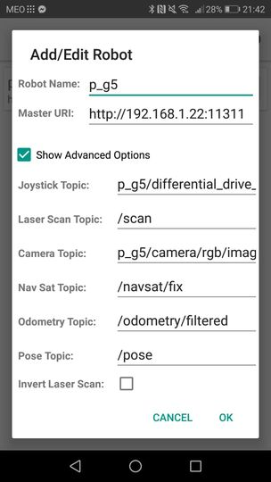
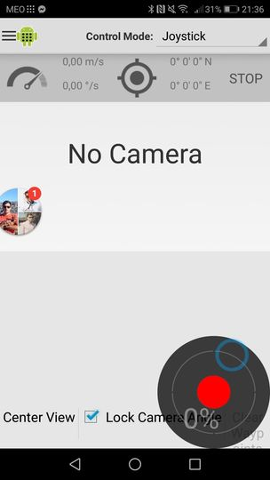
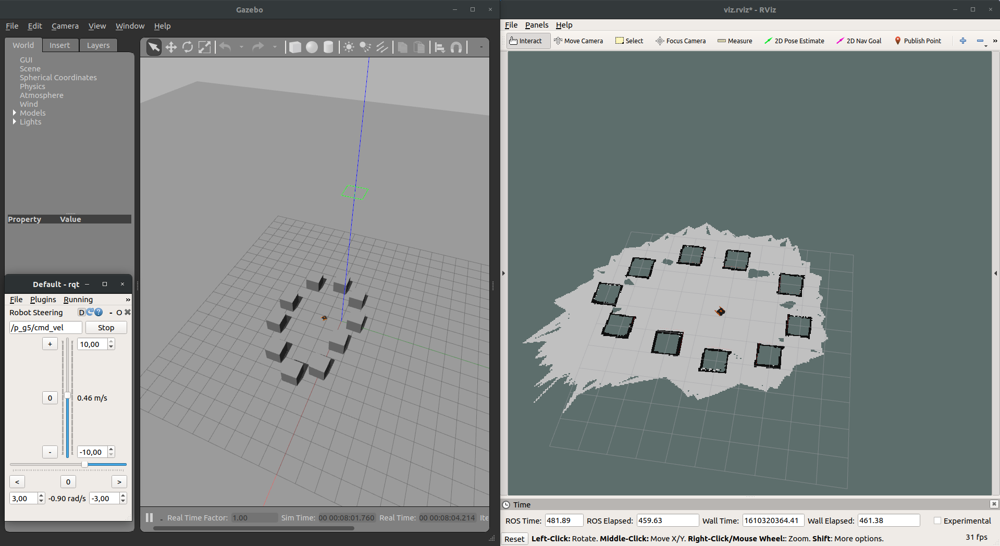
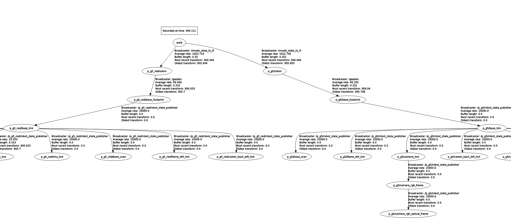

# Turtlebot3 Race
###### Trabalho 3 da unidade curricular de projecto de automação e robótica industrial (PARI) do curso de Engenharía Mecânica da Universidade de Aveiro

# Indice
 - [Instalação](#instalação)
 - [Gazebo](#criação-do-ambiente-simulado)
 - [Rviz](#visualização-rviz)
 - [Spawn](#spawn-do-robot)
 - [Controlo](#comando-do-robot)
 
# Instalação
Certifique-se que ja tem o ROS instalado, pode consultar informação para o fazer [aqui](http://wiki.ros.org/ROS/Installation).

Depois de ter o ROS instalado pode fazer o download do repositório. Lá dentro encontrará três packages Ros.
O Primeiro Package chama-se **p_g5_description**,o segundo **p_g5_bringup** e por último aparece o **pari_fnr**.
Este último package apenas contém informação de um world que poderá ser utilizado no simulador Gazebo.

# Criação do ambiente simulado
Após obter estes packages pode começar a criar o cenário para o seu robot. Abra um terminal e introduza:
        
    roslaunch p_g5_bringup bringup_gazebo.launch

Este comando fará despoletar o simulador gazebo, já carregado com a casa do turtle bot ou outra, dependendo do world escolhido no package: **p_g5_bringup**, launch:**bringup_gazebo**.

       
# Visualização Rviz
Após se ter usado o simulador gazebo é possivel tambem usar o Rviz, software de vizualização 3d, que permitirá ver as
imagens captadas pelo robot, laser scan captados pelo robot, tranformações captadas pelo robo, etc... basicamente
pode fazer a amostragem dos dados. Para tal abrir o terminal e digitar:

    roslaunch p_g5_bringup visualize.launch
    
# Spawn do robot
Tendo agora todos os ambientes gráficos criados pode-se finalmente criar o nosso robot. Para isso no terminal introduzir:
    
    roslaunch p_g5_bringup spawn.launch player_name:=[nome] player_color:=[cor] base_color:=[cor] scan_color:=[cor]

**cor**
 - Black
 - DarkGrey
 - FlatBlack
 - LightBlack
 - Blue
 - Green
 - Grey
 - Orange
 - Brown
 - Red
 - White
 
 
 A cor escolhida, para além de ter de estar na lista acima, também tem de ser uma cor existente no gazebo, [exemplos](http://wiki.ros.org/simulator_gazebo/Tutorials/ListOfMaterials).
 
 
 No final deste comando, se tudo correr bem, deverá obter algo parecido ao da seguinte imagem.
  
 
 
# Comando do robot
Agora para comandar o robot podemos usar o controlador do ROS. Para tal podemos usar este comando no terminal:
    
     roslaunch p_g5_bringup teleop.launch player_name:=[nome]
        
No entanto,se não for um fã de Counter Strike e tiver um comando USB à sua disposição, pode introduzir o seguinte comando ao invés do anterior:

     rosrun teleop_twist_joy teleop_node /cmd_vel:=/<player_name>/differential_drive_controller/cmd_vel
       
Se utilizar esta segunda via, certifique-se que tem o joy instalado, através do seguinte comando:
        
     sudo apt install ros-<ros-distro>joy
        
Pode se ainda optar por controlar o robot através do telemóvel, para isso e necessário instalar a aplicação ROS Control.
Depois de instalada devesse adicionar um novo Robot na aplicação e atribuir um nome e substituir o localhost pelo IP do computador e assim temos a ligação estabelecida. 
Em seguida deve clicar em Show Advanced Options, e substituir o nome dos tópicos para os tópicos que queremos alterar os valores, neste caso para podemos controlar pelo joystick, colocamos o topic: /p_g5/differential_drive_controller/cmd_vel.
Depois de configorar os topicos é so clicar no nomo Robot pode controlar com o joystick, com mostra a imaguem, que os topicos seram enviados

 | 
        
#  Gmapping
Uma funcionalidade interessante do robot e bastante atual nos dias de hoje, é o gmapping. Este consegue recolher 
os dados do lidar do robot e formar um mapa apartir desses resultados. Neste exemplo é mostrado o Gazebo e o Rviz,
no gazebo foram colocados alguns obstaculos para o robot, que como podemos ver, foram bem captados e mostrados 
no Rviz.  

# Nó model_states_to_tf
Através do gazebo podemos ter os valores e possível sabemos para cada robô qual a sua posposição através de (mensagens /gazebo/model_states) e transformá-la em mensagens tf de ROS e assim saber a posição de todos os robôs que se encontra no mundo gazebo.
Na figura a seguir podemos ver que o topico wold e enviada para todos os robôs que estão no Gazibo.

 
      
    
# Condução do Robot numa trajetória pré definida

Após se lançar o mundo gazebo e se ter feito o spawn do robot como explicado anteriormente, basta usar este comando no terminal:

    rosrun p_g5_core player.py

Verá que o robot começa a andar numa trajetória circular.

# Game_bringup
Atraves de deste ficheiro é possivel colocar mais que colocar mais de que um jogador,no mundo Gazelo, e em mais que uma equipa.
O ficheiro faz tambem atraves do ficheiro game.yaml, a atribuição do nome e equipas, conforem assim atribuido.
Atraves deste ficheiro é possivel escolher/configurar a possição inicial  

#  Contacts
Nesta secção foi introduzido um sensor de contacto, que monitoriza os contactos que acontessem com o robo.
Os resultados deste sensor podem ser escutados com o comando:
    
    rostopic echo /<nome_do_robo>/contact

Apos executar este comando seremos presentiados com coisas deste genero:

    header: 
      seq: 3553
      stamp: 
        secs: 172
        nsecs:  93000000
      frame_id: "p_g5/Orange/world"
    states: 
      - 
        info: "Debug:  i:(0/1)     my geom:mike::base_footprint::base_footprint_fixed_joint_lump__camera_link_collision_1\
      \   other geom:p_g5::base_footprint::base_footprint_fixed_joint_lump__base_link_collision\
      \         time:172.092000000\n"
        collision1_name: "mike::base_footprint::base_footprint_fixed_joint_lump__camera_link_collision_1"
        collision2_name: "p_g5::base_footprint::base_footprint_fixed_joint_lump__base_link_collision"
        wrenches: 
          - 
            force: 
              x: -0.346768995712
              y: -0.177576272177
              z: -0.123900535708
            torque: 
              x: 0.0131974778954
              y: -0.0180573332274
              z: -0.0110566288347
        total_wrench: 
          force: 
            x: -0.346768995712
            y: -0.177576272177
            z: -0.123900535708
          torque: 
            x: 0.0131974778954
            y: -0.0180573332274
            z: -0.0110566288347
        contact_positions: 
          - 
            x: -0.288034550622
            y: -1.53446238264
            z: 0.102770491624
        contact_normals: 
          - 
            x: 0.995204062615
            y: 0.0977690036159
            z: 0.00317737115311
        depths: [1.1095616439222431e-07]
        
Neste exemplo em específico podemos verificar a colisão entre o robot *p_g5* e o robot *mike*
