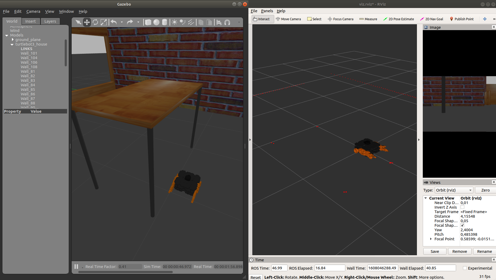

# Turtlebot3 first steps
###### Trabalho 3 da unidade curricular de projecto de automação e robótica do curso de engenharía mecânica da universidade de aveiro

#Indice
 - [Instalação](#instalação)
 - [Gazebo](#criação-do-ambiente-simulado)
 - [Rviz](#visualização-rviz)
 - [Spawn](#spawn-do-robot)
 - [Controlo](#comando-do-robot)
 
# Instalação
Certifique-se que ja tem o ROS instalado, pode consultar informação para o fazer [aqui](http://wiki.ros.org/ROS/Installation).

Depois de ter o ROS instalado pode fazer o download do repositório. Lá dentro encontrará três packages Ros.
O Primeiro Package chama-se **p_g5_description**,o segundo **p_g5_bringup** e por último aparece o **pari_fnr**.
Este último package apenas contém informação de um world que poderá ser utilizado no simulador Gazebo.

# Criação do ambiente simulado
Após obter estes packages pode começar a criar o cenário para o seu robot. Abra um terminal e introduza:
        
        roslaunch p_g5_bringup bringup_gazebo.launch

Este comando fará despoletar o simulador gazebo, já carregado com a casa do turtle bot ou outra, dependendo do world escolhido no package: **p_g5_bringup**, launch:**bringup_gazebo**.

       
# Visualização Rviz
Apos se ter usado o simulador gazebo é possivel tambem usar o Rviz, software de vizualização 3d, que permitirá ver as
imagens captadas pelo robot, laser scan captados pelo robot, tranformações captadas pelo robo, etc... basicamente
pode fazer a amostragem dos dados. Para tal abrir o terminal e digitar:

    roslaunch p_g5_bringup visualize.launch
    
# Spawn do robot
Tendo agora todos os ambientes gráficos criados pode-se finalmente criar o nosso robot. Para isso no terminal introduzir:
    
    roslaunch p_g5_bringup spawn.launch player_name:=[nome] player_color:=[cor] base_color:=[cor] scan_color:=[cor]

**cor**
 - Black
 - DarkGrey
 - FlatBlack
 - LightBlack
 - Blue
 - Green
 - Grey
 - Orange
 - Brown
 - Red
 - White
 
 
 A cor escolhida, para além de ter de estar na lista acima, também tem de ser uma cor existente no gazebo, [exemplos](http://wiki.ros.org/simulator_gazebo/Tutorials/ListOfMaterials).
 
 
 No final deste comando, se tudo correr bem, deverá obter algo parecido ao da seguinte imagem.
  
 
 
# Comando do robot
Agora para comandar o robot podemos usar o controlador do ROS. Para tal podemos usar este comando no terminal:
    
        roslaunch p_g5_bringup teleop.launch player_name:=[nome]
        
No entanto,se não for um fã de Counter Strike e tiver um comando USB à sua disposição, pode introduzir o seguinte comando ao invés do anterior:

       rosrun teleop_twist_joy teleop_node /cmd_vel:=/<player_name>/differential_drive_controller/cmd_vel
       
Se utilizar esta segunda via, certifique-se que tem o joy instalado, através do seguinte comando:
        
        sudo apt install ros-<ros-distro>joy
        

        
        
      
    